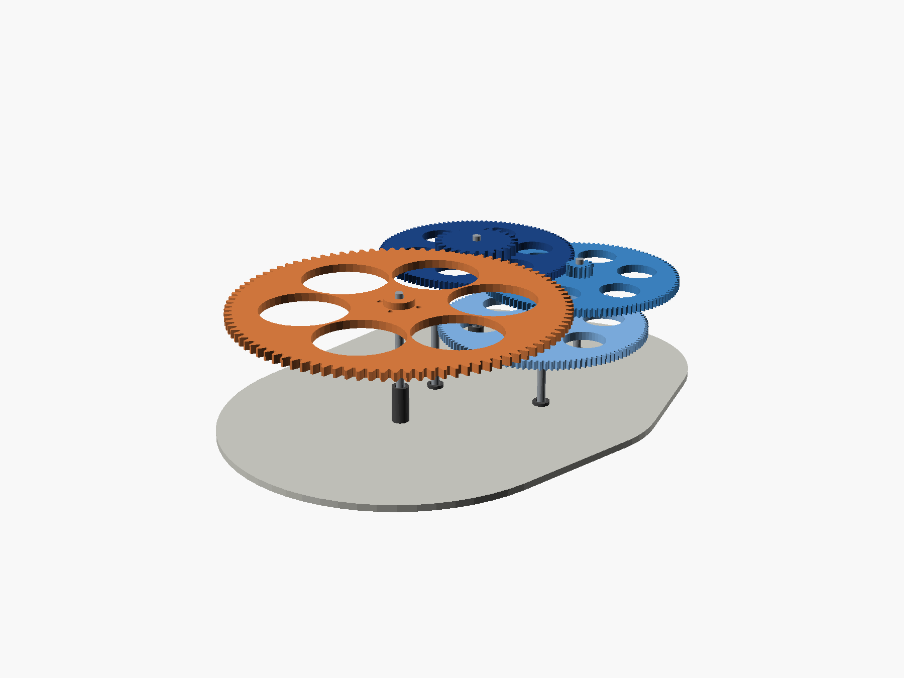

# Sidereal drive gearbox

A 3D-printed gear train that turns a camera at one revolution per **sidereal
day** (86164.0905 s) for wide-field star tracking, driven by a stepper on an
ESP32.



**Status:** gearbox designed and verified in CAD, parts printing, backlash
validated on a test pair. Scope now extends to a **standalone scheduled
device** — wake at dusk, run a GoPro HERO6 night lapse until dawn, rewind for
the next night. See [HARDWARE.md](HARDWARE.md) for the electronics architecture
and bill of materials.

---

## The train

```
NEMA17 --15T--> [120T|15T] --> [120T|15T] --> [120T|24T] --> 96T --> camera
   module 1.0       8:1            8:1            8:1        4:1
                                                        module 2.0
```

**8 × 8 × 8 × 4 = 2048 : 1**

| | |
|---|---|
| microsteps / sidereal day | 13,107,200 (200 steps × 1/32 × 2048) |
| step interval | 6573.80 µs |
| step rate | 152.13 steps/s |
| motor speed | 1.426 rpm |
| output resolution | 0.099 arcsec/µstep |
| centre distances | 67.5 / 67.5 / 67.5 / 120.0 mm |
| footprint | 226.5 × 279 mm, 24.5 mm tall |

Five printed pieces from four files, plus five spacers. See **[PRINTING.md](PRINTING.md)**.

---

## The two things that actually matter

Everything else in this project falls out of these.

### 1. Only the final pinion's radius sets short-exposure trailing

For any mesh both gears contribute equally to output error per unit
eccentricity — the pinion's smaller radius exactly cancels its higher
reduction. But their *periods* differ, and trailing depends on how much the
error moves *during* an exposure:

```
excursion over exposure t  =  (e / r_pinion) × 2π t / 86164
```

Only `r_pinion` survives. That single equation is why the final stage is
module 2.0 with a 24-tooth pinion (r = 24 mm) rather than module 1.0 with 15
teeth (r = 7.5 mm): it cuts a 0.1 mm eccentricity from ~60 arcsec to ~19 arcsec
on every 300 s sub. Stages 1–3 divide by 2048, 256 and 32 — they can be as
sloppy as the printer likes.

### 2. Polar alignment dominates all of it

```
1° of misalignment  →  ~16 arcsec/min of drift
```

That swamps every mechanical error above. A sight tube down the RA axis getting
you to 0.25° is worth more than any amount of gear precision. **Do it first.**

Full derivations and the rejected alternatives are in
**[DESIGN_NOTES.md](DESIGN_NOTES.md)**.

---

## Layout

Square fold, 90° at each stage. Shaft centres in mm:

| Shaft | x | y | Carries |
|---|---|---|---|
| 0 motor | 0 | 0 | 15T module-1 pinion |
| 1 | 67.5 | 0 | 120T + 15T |
| 2 | 67.5 | 67.5 | 120T + 15T |
| 3 | 0 | 67.5 | 120T + **24T module-2** |
| 4 output | 0 | −52.5 | 96T module-2, 196 mm OD |

Print `out/docs/baseplate_template.pdf` at **100% / Actual size** for a 1:1
drilling template.

**Three constraints this layout imposes:**

- **Nothing over Ø13 mm inline at shafts 0–3.** The tightest radial clearance
  in the box is `67.5 − 61 − 2.5 = 4.0 mm`, between a 5 mm shaft and the
  neighbouring wheel's tip circle. A 625ZZ bearing (16 mm OD) gives −1.5 mm and
  collides. Bearings go below the baseplate, never in the gear plane.
- **Shafts 0 and 1 must stay below 19 mm.** The output wheel sits directly over
  both. A stock NEMA17 shaft is 24 mm and fouls it — trim to ~10 mm above the
  plate.
- **No top plate on shafts 0 and 1** for the same reason. Cantilever them; their
  errors divide by 2048 and 256, so it costs nothing.

---

## Electronics

| | |
|---|---|
| Motor | NEMA 17 pancake (~13 N·cm) or a spare Ender 3 42-34. Torque margin is 250×, so pick on weight and current, not torque. Run it at 300–400 mA. |
| Driver | **TMC2209 in UART mode** — StealthChop for smoothness at 152 steps/s, StallGuard4 for the only feedback worth having, MicroPlyer interpolation, 3.3 V logic. |
| Power | 3S LiPo. ~1.0 W total ≈ 85 mA at 12 V → ~24 h on 2200 mAh. Buck the ESP32 rail, don't use a linear regulator. |

**Do not omit** a 100 µF low-ESR cap across VMOT at the driver, and never unplug
the motor with power applied. That is how TMC drivers die.

### Why there is no speed feedback loop

A stepper is synchronous — it advances exactly one microstep per pulse, and the
ESP32 crystal is a ±20 ppm timebase. Over a 300 s exposure that is ±6 ms, or
0.000025° at the output. There is nothing for a speed loop to correct. Use
StallGuard for *stall detection*, which is a real failure mode.

The one thing that must be exact is the step interval: 6573.80 µs is not an
integer, and rounding it costs ~5 s/day of drift. `sidereal_drive.ino` carries
the remainder in a 64-bit accumulator, so the long-term rate is exact for **any**
gear ratio — which is what freed the design to pick ratios for mechanical
convenience.

---

## Scheduled operation

The gearbox is one half. The other half is an ESP32 that keeps time, talks to the
camera over the GoPro WiFi API, and knows where the output shaft is pointing.

- **Controller: ESP32**, not a Pi — unattended robustness. A flat battery
  mid-write corrupts an SD card; LittleFS on an ESP32 comes back.
- **Camera over WiFi, not BLE.** The documented GoPro BLE API starts at HERO9;
  HERO5/6 use the `gpControl` HTTP API at 10.5.5.9, woken by a magic packet.
- **Config over a captive web UI** on the ESP32's own AP. No app, no pairing.
- **AS5600 absolute encoder** on the output shaft, so "home" is read, not searched.
- **~43 Wh per night, 69% of it the camera.** Three nights unaided needs 130 Wh;
  a 6 Ah pack plus a 20 W panel is lighter and never runs out.

Full reasoning, cycle diagram, BOM and pin map: **[HARDWARE.md](HARDWARE.md)**.

## Repo layout

```
star_tracker_gears.scad     the model — single source of truth for every part
make_baseplate_pdf.py       1:1 drilling template (reportlab)
build.ps1                   regenerates every artifact
firmware/sidereal_drive/    ESP32 sketch
PRINTING.md                 what to print, in what order, with what settings
DESIGN_NOTES.md             why the gearbox is what it is
HARDWARE.md                 electronics architecture, BOM, pin map
out/                        generated — meshes are gitignored
  docs/                     assembly renders, laser SVG, drilling template
  _scratch/                 calibration gauges, test jig, superseded exports
```

## Building

```powershell
.\build.ps1                  # everything
.\build.ps1 -Group gears     # just the parts you print
.\build.ps1 -Only pinion.stl # one target
.\build.ps1 -List            # show targets without building
```

Needs OpenSCAD 2021.01+ and Python with `reportlab`. Each STL target is checked
for `Simple: yes` — a watertight solid — and the build fails if one is not.

**Printer calibration lives at the top of `build.ps1`**, not scattered through
the model. On this machine a printed post must run ~0.50 mm under a printed
hole's nominal diameter for a snug rotating fit, which is why the gears carry a
5.2 bore for 4.88 mm nails while the motor pinion needs 5.45 for a ground
5.00 mm shaft.

## Order of work

1. Print the calibration gauges and the test pair. Tune `backlash`.
2. **Build the polar alignment before the gearbox.**
3. Open-loop drive, 50 mm lens, one 5-minute sub. **Measure the trailing.**
4. Only then decide what to fix. Adding an encoder before you have data is
   solving an imaginary problem.
