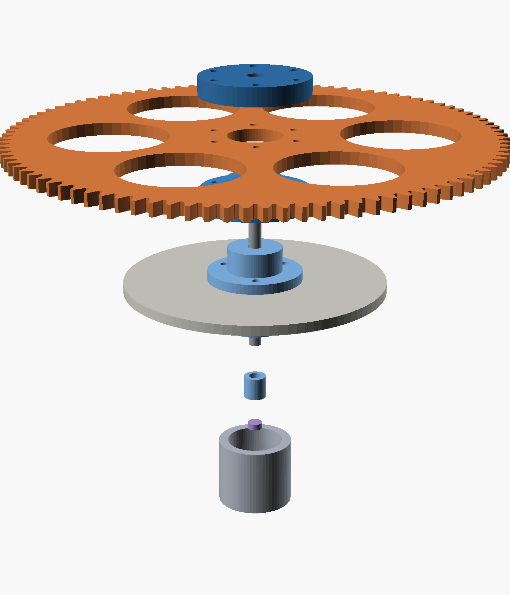

# Sidereal star tracker

A standalone device that turns a camera at one revolution per **sidereal day**
(86164.0905 s) for wide-field astrophotography. It wakes at dusk, configures and
starts a GoPro HERO6 night lapse, tracks until dawn, stops the camera, and
rewinds ready for the next night.



---

## Where this stands

| Area | State |
|---|---|
| Gearbox design | **Settled.** 2048:1, verified in CAD, every STL manifold |
| Printer calibration | **Measured.** Post/hole offset 0.50 mm; motor pinion bore pending one test print |
| Backlash | **Validated** on a test pair at 0.25 mm. One drag spot traced to the pinion — reprint with Z Seam = Random |
| Baseplate | **Designed**, cutting SVG ready to send |
| Output shaft + encoder | **Designed**, needs the bearing gauge printed before the tower |
| Electronics | **Architecture decided**, BOM written, nothing built |
| Firmware | **Not started** beyond the timing core |
| Under the sky | Not yet |

**Next three things**, in order:

1. Print `_scratch/BEARINGGAUGE_pockets.stl`, set `$BrgFit`, then print the tower.
2. Print `pinion.stl` + the two bore variants next to `stage.stl`; keep the one
   that slides onto the NEMA17 shaft without force.
3. Build the polar wedge. **Before** the gearbox — see §2 below.

---

## The train

```
NEMA17 --15T--> [120T|15T] --> [120T|15T] --> [120T|24T] --> 96T --> camera
   module 1.0       8:1            8:1            8:1        4:1
                                                        module 2.0
```

**8 × 8 × 8 × 4 = 2048 : 1**

| | |
|---|---|
| microsteps / sidereal day | 13,107,200 (200 steps × 1/32 × 2048) |
| step interval | 6573.80 µs |
| step rate | 152.13 steps/s |
| motor speed | 1.426 rpm |
| output resolution | 0.099 arcsec/µstep |
| centre distances | 67.5 / 67.5 / 67.5 / 120.0 mm |
| gear stack | 226.5 × 279 mm envelope, 24.5 mm tall |
| baseplate | 121.5 × 174 × 4 mm, ~170 g |

---

## The two things that actually matter

Everything else in this project falls out of these.

### 1. Only the final pinion's radius sets short-exposure trailing

For any mesh, both gears contribute equally to output error per unit
eccentricity — the pinion's smaller radius exactly cancels its higher reduction.
But their *periods* differ, and trailing depends on how much the error moves
**during** an exposure:

```
excursion over exposure t  =  (e / r_pinion) × 2π t / 86164
```

Only `r_pinion` survives. That one equation drove the redesign from 4608:1 to
2048:1: a module-2 24-tooth final pinion (r = 24 mm) instead of module-1 15-tooth
(r = 7.5 mm) cuts a 0.1 mm eccentricity from ~60 arcsec to ~19 arcsec on every
300 s sub. Stages 1–3 divide by 2048, 256 and 32 — they can be as sloppy as the
printer likes.

### 2. Polar alignment dominates all of it

```
1° of misalignment  →  ~16 arcsec/min of drift
```

That swamps every mechanical error above. A sight tube down the RA axis getting
you to 0.25° is worth more than any amount of gear precision. **Build the wedge
first.**

Derivations, rejected alternatives and the design history are in
**[DESIGN_NOTES.md](DESIGN_NOTES.md)**.

---

## Layout

Square fold, 90° at each stage. Shaft centres in mm:

| Shaft | x | y | Carries |
|---|---|---|---|
| 0 motor | 0 | 0 | 15T module-1 pinion |
| 1 | 67.5 | 0 | 120T + 15T |
| 2 | 67.5 | 67.5 | 120T + 15T |
| 3 | 0 | 67.5 | 120T + **24T module-2** |
| 4 output | 0 | −52.5 | 96T module-2, 196 mm OD, on bearings |

**Constraints this layout imposes** — all three were found by drawing it to scale:

- **Nothing over Ø13 mm inline at shafts 0–3.** Tightest radial clearance is
  `67.5 − 61 − 2.5 = 4.0 mm`, shaft to neighbouring wheel tip. A 625ZZ (16 mm)
  gives −1.5 mm and collides; a Ø10 spacer leaves 1.5 mm. **Never fit a stock
  5 mm shaft collar at shafts 2 or 3.**
- **Shafts 0 and 1 must stay below 19 mm.** The output wheel sits over both. A
  stock NEMA17 shaft is 24 mm and fouls it — trim to ~10 mm above the plate.
- **No top plate on shafts 0 and 1**, same reason. Cantilever them; their errors
  divide by 2048 and 256, so it costs nothing.

**Every mesh needs its own Z band.** `pinion_tip + wheel_tip = a + 2m` always, so
a pinion collides with any adjacent wheel, mating or not. Four meshes, four
bands, irreducible. Band *height* can shrink (3 mm faces take the stack from
24.5 to 16 mm) but band *count* cannot.

---

## Baseplate

121.5 × 174 × 4 mm 6061 aluminium, ~170 g. Cut, not printed — too big for the
bed, and it wants stiffness rather than strength.

The outline is a hull of lobes at the five shaft centres, **not** a slab under
the whole gear footprint: the wheels overhang on purpose, so the plate only
carries the shafts and the motor. That is what takes it from ~740 g to 170 g.

The wedge/tripod interface is **4 × M5 on Ø50 centred on the output axis**, not
on the plate centroid. The camera moment gets reacted where it is generated, and
that short load path is why 4 mm is enough.

- `out/docs/baseplate_cut.svg` — send this, 122 × 175 mm, 17 closed contours
- `out/docs/baseplate_template.pdf` — same geometry 1:1 on US Letter, two scale bars

---

## Output shaft and AS5600 encoder

The output is the one shaft that rotates. The encoder magnet must sit on the axis
and turn with the wheel, and the camera load wants real bearings anyway.

Five printed parts plus a 5 × 65 mm ground shaft, 2 × 625ZZ, a **diametric**
6 × 2.5 magnet and an AS5600 breakout. Verified: **magnet face to die = 2.0 mm**,
inside the sensor's 0.5–3.0 mm window; bearing centres 30 mm apart.

Two design points worth not undoing:

- **The wheel locates on a Ø22 register** on the lower hub and is clamped by six
  M3 — not centred by its own bore. A printed 5.2 bore on a 5 mm shaft is worth
  ~0.2 mm of eccentricity, which is exactly what §1 says to avoid.
- **The sensor bracket registers on the same tower boss that holds the lower
  bearing.** The AS5600 needs the magnet centred within ~0.25 mm; that comes from
  one printed feature rather than from careful assembly.

Firmware aid: the AS5600's `AGC` and `MAGNITUDE` registers report "too far / too
close" as a number, so the air gap is measured, not guessed.

---

## Scheduled operation

Full architecture, cycle diagram, BOM and pin map: **[HARDWARE.md](HARDWARE.md)**.

- **ESP32, not a Pi.** Unattended robustness: a flat battery mid-write corrupts
  an SD card, LittleFS comes back. Also ~0.6 W cheaper, ≈7 Wh a night.
- **GoPro over WiFi, not BLE.** The documented GoPro BLE API starts at HERO9 —
  the earlier HERO5 Bluetooth failure was expected, not a Pi problem. HERO6 uses
  the `gpControl` HTTP API at 10.5.5.9, woken by a magic packet.
- **Captive web UI on the ESP32's own AP.** No app, no pairing. One radio means
  one mode at a time, which keeps the state machine simple.
- **~43 Wh per night, 69% of it the camera.** Three nights unaided needs 130 Wh;
  a 6 Ah pack plus a 20 W panel is lighter and never runs out.

**Two cycle rules that are not obvious:** always approach the start angle from
the forward direction (rewind reverses ~750 arcsec of backlash, which otherwise
gets taken up as drift during your first subs), and bias the counterweight so the
mesh stays loaded on one flank.

### Why there is no speed feedback loop

A stepper is synchronous, and the ESP32 crystal is ±20 ppm — over a 300 s exposure
that is 0.000025° at the output. There is nothing for a speed loop to correct. Use
StallGuard for *stall detection*, which is a real failure mode.

What must be exact is the step interval: 6573.80 µs is not an integer, and
rounding costs ~5 s/day of drift. `sidereal_drive.ino` carries the remainder in a
64-bit accumulator, so the rate is exact for **any** ratio — which is what freed
the design to choose gears for mechanical convenience.

---

## Printer calibration — measured, not guessed

These live at the top of `build.ps1`. They are the hardest-won numbers here.

| Constant | Value | How it was found |
|---|---|---|
| `$Bore` | 5.20 | gears run on 4.88 mm 20d nails |
| `$MotorBore` | 5.45 | NEMA17's ground 5.00 mm shaft needs a bigger bore than the nails |
| `$PostD` | 4.70 | fit gauge |
| `$BrgFit` | 0.50 | **provisional** — print the bearing gauge |

**A printed post must run ~0.50 mm under a printed hole's nominal diameter** for
a snug rotating fit on this printer. That is hole shrink plus post growth
combined, and it is on the high side of typical (0.30–0.40), which hints flow
runs a few percent hot.

Three gauges exist because these cannot be predicted, only measured:
`FITGAUGE` (posts), `BOREGAUGE` (holes), `BEARINGGAUGE` (625ZZ pockets).

---

## Repo layout

```
star_tracker_gears.scad     the model — single source for every part
make_baseplate_pdf.py       1:1 drilling template (reportlab)
build.ps1                   regenerates every artifact
firmware/sidereal_drive/    ESP32 sketch
PRINTING.md                 what to print, in what order, with what settings
DESIGN_NOTES.md             why the gearbox is what it is
HARDWARE.md                 electronics architecture, BOM, pin map
out/                        generated — meshes gitignored
  docs/                     renders, laser SVG, baseplate SVG, template
  _scratch/                 calibration gauges, test jig, superseded exports
```

## Building

```powershell
.\build.ps1                     # everything
.\build.ps1 -Group gears        # the parts you print
.\build.ps1 -Group encoder      # output shaft assembly
.\build.ps1 -Group calibration  # the three gauges
.\build.ps1 -Group docs         # renders, SVGs, PDF
.\build.ps1 -List               # show targets without building
```

Needs OpenSCAD 2021.01+ and Python with `reportlab`. Every STL target is checked
for `Simple: yes` and the build fails if one is not.

---

## Traps worth remembering

Each of these cost real time and none of them announce themselves.

- **OpenSCAD: `children()` nested inside `union()` inside `difference()` inside
  `if()` does not resolve.** The section cut silently did nothing. Apply cuts at
  the call site instead.
- **OpenSCAD preview mis-renders `difference()` when children carry `color()`.**
  Geometry was correct all along; only the OpenCSG preview lied. Section images
  need `--render`, which then discards colour — hence the exploded view.
- **PowerShell 5.1 strips inner quotes** from native-exe arguments, so
  `part="spacers"` arrives as a bare variable. Backslash-escape them. And `2>&1`
  on a native command wraps stderr in ErrorRecords that abort under
  `$ErrorActionPreference = 'Stop'`.
- **Print orientation is load-bearing on the bearing tower.** The lower pocket
  must open onto the bed or the bearing cannot be inserted at all, and both the
  pocket ceiling and the flange underside are 45° cones rather than flat
  overhangs. Upside down it is unusable.
- **Verify meshes, not file sizes.** Bounding-box checks caught a wheel that had
  changed only in float formatting, and a D-shaft cut that had sliced the pinion
  into five disconnected bodies (`Volumes: 5` instead of 2).
- **Binaries need `.gitattributes`.** Without it a fresh Windows clone rewrites
  LF to CRLF *inside* the PDF and PNGs and corrupts them.

## Order of work

1. Calibration gauges, then the test pair. Tune `backlash`.
2. **Build the polar wedge before the gearbox.**
3. Open-loop drive, 50 mm lens, one 5-minute sub. **Measure the trailing.**
4. Only then decide what to fix. Adding an encoder before you have data is
   solving an imaginary problem — the encoder in this design is for *scheduling*
   and stall detection, not for correcting tracking.
